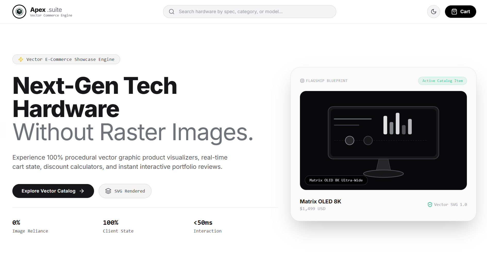
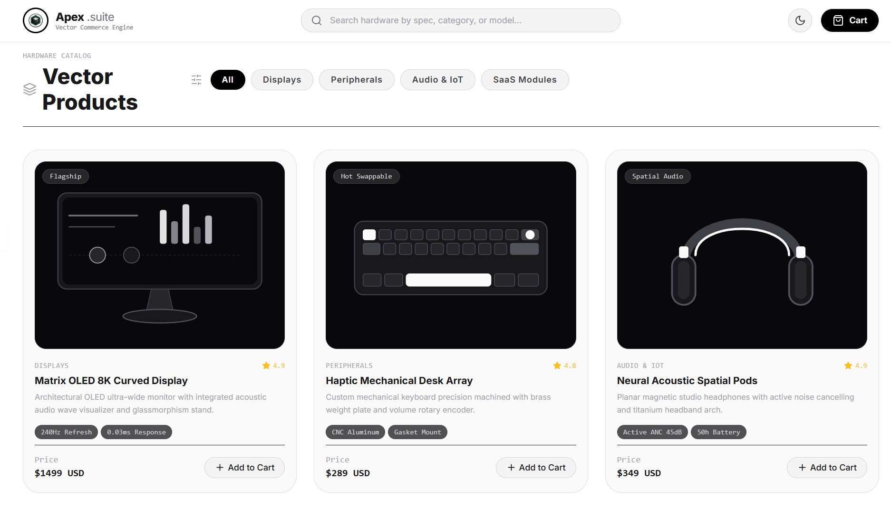
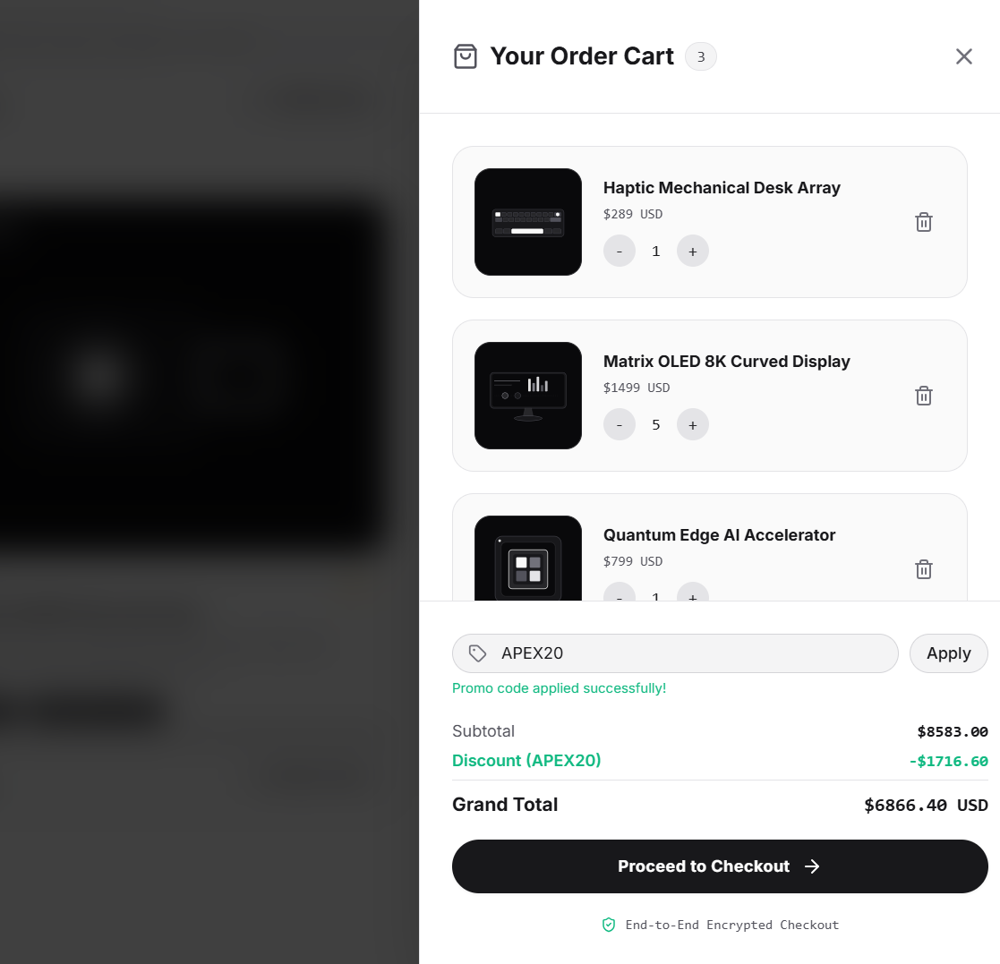
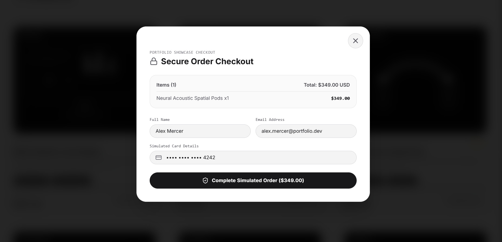

# 📦 Apex Suite — Vector E-Commerce & Hardware Catalog Engine (Portfolio UI Showcase)

[](https://nextjs.org/)
[](https://react.dev/)
[](https://www.typescriptlang.org/)
[](https://tailwindcss.com/)
[](https://ui.shadcn.com/)
[](https://apex-commerce-suite.vercel.app)

**Apex Suite** is a high-performance vector e-commerce storefront and hardware catalog frontend showcase built with **Next.js 14 (App Router)**, **React 18**, **TypeScript**, **Tailwind CSS**, and **Radix UI Primitives**.

Engineered with 100% procedural vector graphic product visualizers (zero raster image assets), it features real-time cart state management, active promo code discount calculations, slide-over order drawers, simulated checkout modals, category filtering, live specification search, and light/dark theme modes.

> 🌐 **Live Web Application**: [https://apex-commerce-suite.vercel.app](https://apex-commerce-suite.vercel.app)

---

## 🖼️ Application Interface Gallery

### 1. Vector E-Commerce Showcase Header


### 2. Procedural Vector Product Catalog & Specs


### 3. Interactive Slide-Over Cart Drawer & Discount Engine


### 4. Simulated Order Checkout Modal


---

## ✨ Core Technical Capabilities & UI Modules

- 🎨 **100% Procedural Vector Visualizers (`ProductVector.tsx`)**: Zero raster image dependencies. Inline SVG vector illustration engine rendering architectural OLED displays, haptic mechanical keyboards, spatial audio studio pods, and quantum AI accelerators.
- 🛒 **Cart State & Discount Engine (`CartContext.tsx` & `CartDrawer.tsx`)**: React Context state management for item additions, dynamic quantity controls, subtotal calculations, and promo code validation (`APEX20` 20% discount engine).
- 🔍 **Live Hardware Catalog Engine (`ProductGrid.tsx`)**: Real-time specification search bar and category filtering tabs (*Displays, Peripherals, Audio & IoT, SaaS Modules*).
- 🔒 **Simulated Order Checkout (`CheckoutModal.tsx`)**: Accessible Radix/Shadcn dialog modal handling user details input and instant order confirmation simulation.
- 🌓 **Dynamic Theme Engine (`ThemeContext.tsx`)**: Light/Dark mode state controller (`next-themes`) and dynamic sticky navigation header with cart item badge counter.

---

## 🛠️ Tech Stack

- **Core Framework**: Next.js 14.2 (App Router)
- **UI Library**: React 18
- **Language**: TypeScript 5.0
- **Styling**: Tailwind CSS 3.4
- **UI Primitives**: Radix UI & Shadcn UI
- **Drawer & Modals**: Custom Slide-Over & Modal Overlays (React Portals & Tailwind CSS)
- **Icons**: Lucide React

---

## 📂 Repository Structure

```
apex-commerce-suite/
├── public/                 # High-resolution screenshots & web assets
│   ├── hero-preview.png        # Hero section screenshot
│   ├── vector-catalog.png      # Vector catalog screenshot
│   ├── cart-drawer.png         # Slide-over cart drawer screenshot
│   ├── checkout-modal.png      # Checkout modal screenshot
│   └── site.webmanifest
├── src/
│   ├── app/
│   │   ├── components/     # UI components
│   │   │   ├── Header.tsx            # Sticky navigation bar & theme toggle
│   │   │   ├── Hero.tsx              # Hero banner & blueprint feature card
│   │   │   ├── ProductGrid.tsx       # Live spec search & category filtering
│   │   │   ├── ProductCard.tsx       # Individual vector product card
│   │   │   ├── ProductVector.tsx     # Procedural inline SVG graphic engine
│   │   │   ├── CartDrawer.tsx        # Slide-over cart & promo code calculator
│   │   │   ├── CheckoutModal.tsx     # Simulated checkout dialog modal
│   │   │   ├── CartContext.tsx       # Cart state & discount context provider
│   │   │   ├── ThemeContext.tsx      # Light/Dark mode context provider
│   │   │   └── Footer.tsx            # Footer & status badges
│   │   ├── globals.css               # Tailwind directives & design tokens
│   │   ├── layout.tsx                # Metadata & root layout
│   │   └── page.tsx                  # Main page composition
├── package.json
└── README.md
```

---

## 🚀 Local Development Setup

```bash
# 1. Clone the repository
git clone https://github.com/m-ali-swe/apex-commerce-suite.git

# 2. Change working directory
cd apex-commerce-suite

# 3. Install dependencies
npm install

# 4. Start local development server
npm run dev
```

Open [http://localhost:3000](http://localhost:3000) in your browser.
